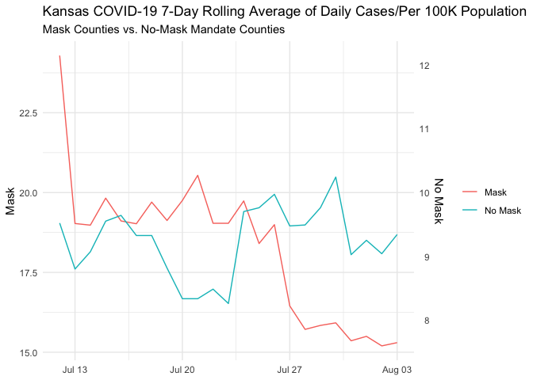
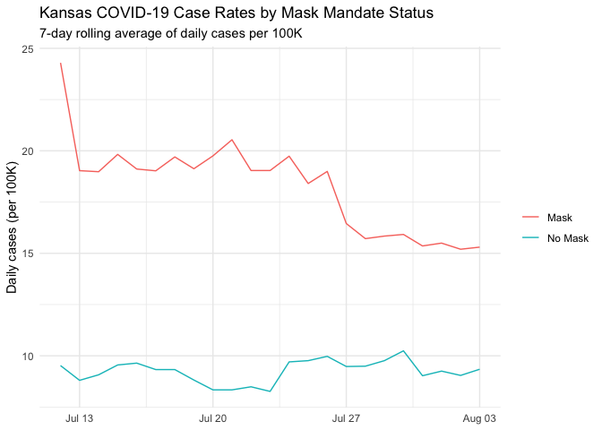

Lab 07 - Conveying the right message through visualisation
================
Lily Botha
02/24/2026

### Load packages and data

``` r
library(tidyverse) 
```

``` r
df <- read_csv("~/Documents/GitHub/lab_07_betterviz/kansas_grouped_rolling_avg.csv")
```

    ## Rows: 46 Columns: 3
    ## ── Column specification ────────────────────────────────────────────────────────
    ## Delimiter: ","
    ## chr  (1): mask_mandate
    ## dbl  (1): rolling_avg
    ## date (1): date
    ## 
    ## ℹ Use `spec()` to retrieve the full column specification for this data.
    ## ℹ Specify the column types or set `show_col_types = FALSE` to quiet this message.

### Exercise 1

The plot is misleading because the axes are on different scales.

``` r
ggplot(df, aes(x = date)) +
  geom_line(aes(
    y = ifelse(mask_mandate == "No Mask", rolling_avg * 2, rolling_avg), 
    color = mask_mandate),
  ) +
  scale_y_continuous(
    name = "Mask",
    sec.axis = sec_axis(~ . / 2, name = "No Mask")
  ) +
  labs(
    title = "Kansas COVID-19 7-Day Rolling Average of Daily Cases/Per 100K Population",
    subtitle = "Mask Counties vs. No-Mask Mandate Counties",
    x = NULL,
    color = NULL
  ) +
  theme_minimal()
```

<!-- -->

### Exercise 2

``` r
ggplot(df, aes(x = date, y = rolling_avg, color = mask_mandate)) +
  geom_line() +
  labs(
    title = "Kansas COVID-19 Case Rates by Mask Mandate Status",
    subtitle = "7-day rolling average of daily cases per 100K",
    x = NULL,
    y = "Daily cases (per 100K)",
    color = NULL
  ) +
  theme_minimal()
```

<!-- -->

### Exercise 3

This plot shows that counties with mask mandates consistently has higher
COVID case rates than counties without mask mandates. Rates in mask
counties start very high and then gradually decline, while no-mask
counties remain relatively stable at a lower level throughout.

### Exercise 4

This plot shows that COVID case rates differed between counties with and
without mask mandates during this short time period, but it doesn’t
provide strong evidence about whether mask wearing reduces COVID spread
because many other factors could explain the trends/differences. This
doesn’t fully align with my knowledge about how mask wearing reduces
transmission.
